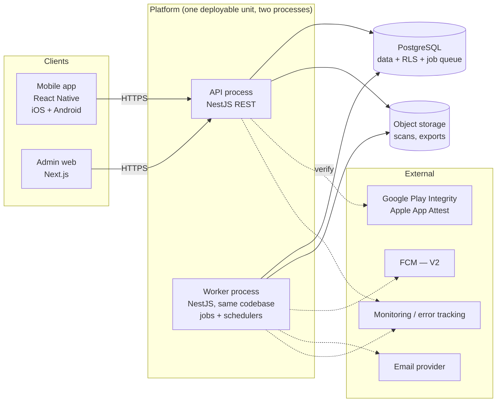
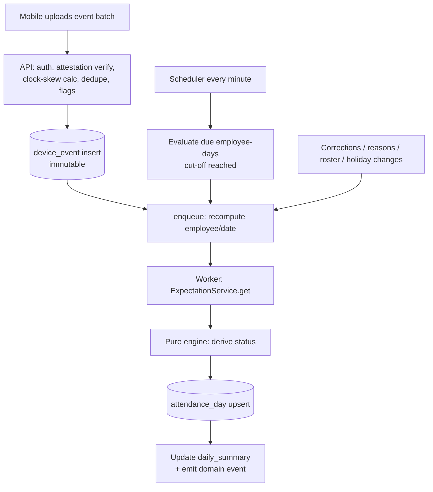
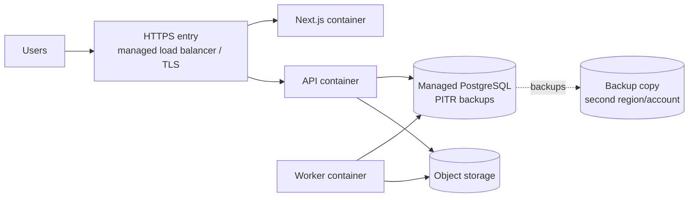

# Timekeeper Work
## Technical Architecture Document

Version: 0.3 (draft for review)
Status: Draft — based on PRD v1.9 (`docs/Timekeeper_Work_PRD.md`)
Audience: engineering lead, backend / mobile / web developers, QA
Scope: the **pilot tier** (1–2 tenants, ~4 months, ~640 employees), built by **one full-stack developer** (decision v0.2, see Section 14). The production tier is covered only where a decision now would be expensive to undo later.

> Section references like "PRD 6.4" point to the PRD. Where this document recommends something that **differs from the PRD**, it is marked **[Deviation]** and listed in Section 17 so the PRD can be updated deliberately.

---

# 1. Architecture Drivers

These PRD requirements shape almost every decision below.

| # | Driver | PRD | Consequence |
|---|---|---|---|
| D1 | Attendance is derived from phone geofence events, not manual entry | 6 | Mobile is the data source; reliability on iOS/Android background limits decides product success |
| D2 | Data must be trusted (spoofing, clock tampering, buddy punching) | 6.7, 6.8 | Device attestation, server time authority, immutable raw events, anomaly flags |
| D3 | Offline tolerance; events arrive late | 6.8 | Idempotent ingest, recomputation of past days, outbox on device |
| D4 | Rules change over time but history must not | 22.1 | Effective-dated configuration; status is a pure function of (events, rules-as-of-date) |
| D5 | Standard days and 24 h shifts share one engine | 6.1, 23 | One `getExpectation()` interface; engine never reads schedule tables directly |
| D6 | Multi-tenant SaaS, strict isolation | 2, 24.3 | `tenant_id` everywhere + PostgreSQL Row-Level Security |
| D7 | Role + location/department scoping | 4 | Authorization is data-scoped on the server for every query |
| D8 | Everything important is audited | 15.1 | Append-only audit log written in the same transaction as the change |
| D9 | Pilot budget: small, cheap, simple to operate; hosted abroad | 24, 25, 15.3 | Modular monolith, Postgres-only infrastructure (queue, cache), managed services, no Kubernetes |
| D10 | Personal data law and consent | 15.3, 15.4 | Consent gate in device registration, retention jobs, processors register, PII-safe logging |

---

# 2. System Context and Components



## 2.1 Components

| Component | Responsibility | Technology |
|---|---|---|
| **Mobile app** | Login, QR device registration, consent acknowledgement, geofence registration and detection, location verification, offline outbox + sync, health check, attendance history | React Native (TypeScript) + native modules for geofencing / attestation |
| **Admin web** | Dashboard, daily attendance, analytics, employees, locations, schedules/shifts, holidays, reasons, corrections, anomaly queue, reports/exports, consent forms, audit log | Next.js (App Router), TypeScript, Tailwind CSS |
| **API** | REST `/v1`, authentication, authorization, validation, writes, reads, event ingest endpoint | NestJS on Node.js |
| **Worker** | Attendance processing, scheduled evaluations (no-show cut-off, missing heartbeats), recomputation, summaries, report generation, retention, email | Same NestJS codebase, run as a separate process (`node dist/worker.js`) |
| **PostgreSQL** | System of record, RLS tenant isolation, job queue (pg-boss), cache tables | Managed PostgreSQL (version ≥ 15) |
| **Object storage** | Consent scans, generated exports, consent PDFs | S3-compatible bucket, private, server-side encryption |
| **Attestation verifiers** | Verify Play Integrity tokens / App Attest assertions | Google/Apple APIs, called from the API |

## 2.2 Why a modular monolith

- One team, ~640 employees, 1–2 tenants: microservices would add cost and operational burden with no benefit.
- Strict module boundaries (Section 3) keep a later split possible. The only likely future split is the **ingest/processing path** (24.1 production tier), which is already asynchronous through the queue.
- One codebase, one database, one deployment keep the 99.5% pilot SLO achievable with a small team.

---

# 3. Backend Module Design (NestJS)

Each module owns its tables and exposes services; other modules call services, never each other's tables (enforced with lint rules / import boundaries).

| Module | Owns | Notes |
|---|---|---|
| `tenancy` | tenants, tenant settings | time zone, retention, policy switches (anomaly mode, correction approval) |
| `identity` | user accounts, sessions, TOTP, invites, password reset | PRD 15.2 |
| `access` | roles, user scopes | Guards + query scoping helpers |
| `org` | locations, departments | Geofence radius rules (100–500 m) |
| `employees` | employees, lifecycle, import | Import with dry-run (PRD 12.3) |
| `devices` | devices, onboarding/replacement QR, attestation keys | PRD 5, 21 |
| `consent` | consent records, form generation (PDF), scans | PRD 15.4; consent gate used by `devices` |
| `schedule` | working week, exceptions, holidays, shift templates/patterns/assignments/overrides, temporary location assignments | **Exposes `ExpectationService.get(employee, date)`** (PRD 6.1, 23.5) |
| `rules` | effective-dated attendance rules (grace, cut-off, min stay, accuracy) | |
| `events` | raw device events, heartbeats, ingest endpoint, dedupe | Immutable |
| `attendance` | attendance engine, `attendance_day`, anomalies, corrections, daily summary | Pure-function core |
| `reasons` | reason types, assignments | |
| `reporting` | dashboard queries, analytics, exports, scheduled report jobs | Reads summaries |
| `audit` | audit log | Append-only; written via a transactional helper |
| `platform` | Super Admin: tenants, health | |
| `jobs` | job definitions, schedulers | pg-boss wrapper behind an interface |

**Cross-cutting:** request context (tenant, user, role, scope), validation (Zod / class-validator), error model, idempotency keys, structured logging with PII masking, OpenAPI generation.

---

# 4. Key Design Decisions (ADR summary)

| ID | Decision | Alternatives | Why |
|---|---|---|---|
| ADR-1 | Modular monolith, API + Worker processes | Microservices, serverless functions | Pilot cost/complexity; clear module seams |
| ADR-2 | PostgreSQL only: data, RLS, queue (pg-boss), cache tables | Redis, SQS, Kafka | One thing to run and back up; load is ~20 events/s (PRD 24.1). Queue behind an interface |
| ADR-3 | **Raw events are immutable; `attendance_day` is derived** and fully recomputable | Update status in place | Late sync, rule changes, corrections, audit; PRD 22.3 |
| ADR-4 | **Server time is the authority**; device time + monotonic clock used only to derive event time | Trust device clock | PRD 6.8; prevents clock-tampering |
| ADR-5 | **Geofence detection on device via OS facilities; server decides status** | Continuous GPS streaming | Battery, privacy (PRD 15.3 forbids trails), OS reliability |
| ADR-6 | **Effective-dated configuration** with exclusion constraints, status computed with the rule version in force on the work date | Latest-config-wins | PRD 22.1 |
| ADR-7 | **One expectation interface** `getExpectation(employee, work_date)` | Engine reads schedule tables | PRD 23.5; shifts without touching the engine |
| ADR-8 | **RLS on every tenant table** + app role without `BYPASSRLS`; tenant set per transaction | App-level filtering only | Defence in depth (PRD 24.3) |
| ADR-9 | SQL-first data access (Kysely or Drizzle, SQL migrations) rather than a heavy ORM | Prisma, TypeORM | Heavy use of RLS, exclusion constraints, window functions, partial indexes; typed queries still wanted |
| ADR-10 | Shared TypeScript monorepo (pnpm workspaces) with generated API client | Separate repos | One team; shared types and the **pure rules engine** used by API, worker and tests |
| ADR-11 | REST + OpenAPI | GraphQL | Simpler for 3 clients and caching; contract-first client generation |
| ADR-12 | Managed PostgreSQL + managed container service; Terraform IaC; GitHub Actions CI/CD | Self-managed VMs, Kubernetes | Pilot RPO/RTO need point-in-time recovery without ops effort |

---

# 5. Data Architecture

## 5.1 Conventions

- Primary keys: `uuid` (v7 preferred for index locality).
- Every tenant-owned table has `tenant_id uuid NOT NULL` and **composite foreign keys** `(tenant_id, other_id)` so a row can never point at another tenant's row.
- Timestamps `timestamptz` (UTC). Calendar concepts (work date, holiday date, valid_from) are `date` interpreted in the **location/tenant time zone** (PRD 22.2).
- Soft state via `status` columns; hard deletes only by retention jobs.
- Audit columns: `created_at`, `created_by`, `updated_at`, `updated_by`.
- **Effective dating:** `valid_from date NOT NULL`, `valid_to date NULL` (open-ended) with a `btree_gist` **exclusion constraint** to forbid overlaps per subject.

## 5.2 Row-Level Security pattern

```sql
-- application role has no BYPASSRLS; each transaction sets the tenant
CREATE ROLE app_user NOLOGIN;            -- granted to the login role used by the API/worker
ALTER TABLE employee ENABLE ROW LEVEL SECURITY;
ALTER TABLE employee FORCE ROW LEVEL SECURITY;

CREATE POLICY tenant_isolation ON employee
  USING (tenant_id = current_setting('app.tenant_id')::uuid)
  WITH CHECK (tenant_id = current_setting('app.tenant_id')::uuid);

-- per request / job, inside the transaction:
-- SELECT set_config('app.tenant_id', $1, true);   -- local to the transaction
```

- A request wrapper opens a transaction, sets `app.tenant_id`, runs the handler. Works with transaction-level connection pooling because it is transaction-local.
- Super Admin platform queries and some cross-tenant jobs use a **separate role** with explicit, audited access paths (never the same role as tenant traffic).
- **Mandatory test:** for every table, a test connects as tenant A and asserts zero rows/zero writes against tenant B (PRD 24.3). Missing `ENABLE ROW LEVEL SECURITY` fails CI.

## 5.3 Core tables

(Selected columns only; full DDL lives in migrations.)

### Tenancy, identity, access

| Table | Key columns |
|---|---|
| `tenant` | id, name, time_zone (default `Asia/Ulaanbaatar`), status |
| `tenant_setting` | tenant_id, key, value (jsonb): anomaly_mode (`accept_and_flag`), correction_approval (`off`), retention_*, accuracy_threshold_m |
| `user_account` | id, tenant_id, username, password_hash (Argon2id), role (`SUPER_ADMIN`/`ORG_ADMIN`/`HR`/`MANAGER`/`EMPLOYEE`), employee_id (for EMPLOYEE), totp_secret_enc, totp_enabled, must_change_password, locked_until, status |
| `user_scope` | tenant_id, user_id, location_id NULL, department_id NULL (deny-by-default if no rows for MANAGER) |
| `auth_session` | id, user_id, device_id NULL, refresh_hash, expires_at, revoked_at |
| `invite` | tenant_id, user_id, code_hash, expires_at, used_at |

### Organization and employees

| Table | Key columns |
|---|---|
| `department` | tenant_id, id, name, active |
| `location` | tenant_id, id, name, address, lat, lng, radius_m CHECK (100–500), active, working_week_mode (`INHERIT`/`OVERRIDE`) |
| `employee` | tenant_id, id, employee_no (unique per tenant), full_name, department_id, primary_location_id, status (`ACTIVE`/`DISABLED`/`ARCHIVED`), start_date, end_date, schedule_mode (`STANDARD`/`SHIFT`), manual_attendance bool, device_model, os_version, device_compatible |
| `temp_location_assignment` | tenant_id, employee_id, location_id, from_date, to_date, reason; **exclusion constraint** on (employee_id, daterange) |

### Devices, QR, consent

| Table | Key columns |
|---|---|
| `device` | tenant_id, id, employee_id, platform, model, os_version, app_version, attestation_key_id / public key, status (`ACTIVE`/`DISABLED`/`REPLACED`), registered_at, disabled_at, disabled_reason; **partial unique index** `(tenant_id, employee_id) WHERE status = 'ACTIVE'` enforces one active device (PRD 5) |
| `onboarding_qr` | tenant_id, id, kind (`ONBOARDING`/`REPLACEMENT`), employee_id NULL, token_hash, expires_at, max_uses, used_count, cancelled_at, created_by |
| `consent_record` | tenant_id, id, employee_id, form_id (printed code), version, status (`PRINTED`/`SIGNED`/`WITHDRAWN`), signed_on, scan_object_key, recorded_by, recorded_at |

### Time rules and schedules (effective-dated)

| Table | Key columns |
|---|---|
| `attendance_rule_version` | tenant_id, location_id, valid_from, valid_to, grace_minutes, cutoff_hours, min_stay_minutes, early_window_minutes |
| `working_week_version` | tenant_id, location_id NULL (NULL = tenant default), valid_from, valid_to |
| `working_week_day` | working_week_version_id, weekday 1–7, working bool, start_time, end_time |
| `working_day_exception` | tenant_id, location_id NULL, date, working bool, start_time, end_time |
| `holiday` | tenant_id, id, name, from_date, to_date, type, repeats_yearly, applies_to (all / location ids) |
| `shift_template` | tenant_id, id, name, start_time, duration_minutes (≤ 1440, may cross midnight), grace_minutes, cutoff_hours, early_window_minutes, observes_holidays bool, valid_from, valid_to |
| `shift_pattern` | tenant_id, id, name, cycle_length_days |
| `shift_pattern_day` | pattern_id, day_index, template_id NULL (NULL = off) |
| `shift_assignment` | tenant_id, employee_id, pattern_id OR template_id, cycle_start_date, from_date, to_date; exclusion constraint on (employee_id, daterange) |
| `shift_override` | tenant_id, employee_id, work_date, kind (`ADD`/`REMOVE`/`SWAP`), template_id NULL, reason, created_by |

### Events and attendance

```sql
CREATE TABLE device_event (
  id                 uuid PRIMARY KEY,
  tenant_id          uuid NOT NULL,
  device_id          uuid NOT NULL,
  employee_id        uuid NOT NULL,
  client_event_id    uuid NOT NULL,           -- idempotency key from the app
  type               text NOT NULL,           -- ENTER | EXIT | LOCATION_DISABLED | PERMISSION_CHANGE
  geofence_location_id uuid,
  device_time        timestamptz NOT NULL,    -- untrusted, informational
  mono_offset_ms     bigint NOT NULL,         -- ms between event and upload, device monotonic clock
  server_received_at timestamptz NOT NULL DEFAULT now(),
  event_time         timestamptz NOT NULL,    -- DERIVED: server_received_at - mono_offset_ms
  clock_skew_ms      bigint,
  accuracy_m         real,
  lat double precision, lng double precision, -- nulled after 30 days (PRD 15.3)
  provider           text, is_mock boolean,
  attestation_state  text,                    -- OK | FAILED | MISSING
  flags              text[] NOT NULL DEFAULT '{}',   -- MOCK_LOCATION, LOW_ACCURACY, CLOCK_SKEW ...
  UNIQUE (tenant_id, device_id, client_event_id)
);
CREATE INDEX ON device_event (tenant_id, employee_id, event_time);
```

| Table | Key columns |
|---|---|
| `device_heartbeat` | tenant_id, device_id, received_at, permission_state, location_services_on, battery_saver, app_version (retained 90 days) |
| `attendance_day` | tenant_id, employee_id, work_date, expected bool, expected_location_id, shift_template_id NULL, shift_start timestamptz, shift_end timestamptz, status (`ON_TIME`/`LATE`/`EXCUSED`/`NO_SHOW`/`PENDING`/`NOT_EXPECTED`/`WORKED_OFF_DAY`), arrival_at, late_minutes, reason_assignment_id, source (`AUTO`/`CORRECTED`), correction_id, flags text[], inputs_hash, computed_at, rule_versions jsonb. **PK (tenant_id, employee_id, work_date)** |
| `attendance_correction` | tenant_id, id, employee_id, work_date, original_status, corrected_status, corrected_arrival_at, reason_code, note, created_by, created_at, revoked_at |
| `anomaly` | tenant_id, id, event_id, employee_id, code, state (`OPEN`/`CONFIRMED`/`REJECTED`/`RECHECK`), decided_by, decided_at |
| `daily_summary` | tenant_id, work_date, location_id, department_id, expected, on_time, late, excused, no_show, pending, flagged (maintained incrementally; PK all five key columns) |

### Reasons, audit, jobs

| Table | Key columns |
|---|---|
| `reason_type` | tenant_id, id, name, active (15 predefined for 310) |
| `reason_assignment` | tenant_id, id, employee_id, reason_type_id, from_date, to_date, description, ended_at |
| `audit_log` | id (bigserial), tenant_id, occurred_at, actor_user_id, actor_role, action, entity_type, entity_id, before jsonb, after jsonb, ip, user_agent, prev_hash, row_hash. `INSERT` only: `REVOKE UPDATE, DELETE` from app role |
| `export_job` | tenant_id, id, requested_by, kind, params, status, object_key, expires_at |
| `event_anomaly_counter`, pg-boss tables | internal |

## 5.4 Indexing and volume

At pilot scale volumes are small: ~640 employees × ~10 events/day ≈ 6–7 k events/day (~2.3 M/year); heartbeats ~36 k/day (retained 90 days); `attendance_day` ~640 rows/day.

- Indexes: `(tenant_id, employee_id, event_time)` on events; `(tenant_id, work_date, status)` and `(tenant_id, work_date, expected_location_id)` on `attendance_day`; `daily_summary` PK covers dashboard reads.
- **Partitioning deferred (PRD 24.3, changed in v1.8):** `device_event` and `audit_log` are **not** partitioned during the pilot (~2 M rows/year; partitioned unique constraints complicate the idempotency key). Plan partitioning with the production tier, using a separate dedupe table if needed. Retention is handled by batched deletes/updates.

## 5.5 Retention jobs (PRD 15.3)

| Data | Rule |
|---|---|
| Raw coordinates (`lat/lng` in `device_event`) | set to NULL after 30 days |
| `device_heartbeat` | delete after 90 days |
| `attendance_day`, `device_event` (without coordinates), corrections | delete after **2 years** |
| `audit_log` | keep ≥ 12 months; delete after configured period |
| Disabled/archived employees | per PRD 12.2 |
Jobs run nightly, in small batches, and write a summary entry to the audit log.

---

# 6. Attendance Engine

## 6.1 Pipeline



Everything that can change a day's status — new event, reason change, correction, roster/holiday/rule change — results in **"recompute (employee, work_date)"** jobs. There is one code path, so late sync and manual edits cannot diverge.

## 6.2 Event ingest (`POST /v1/events/batch`)

1. Authenticate (device-bound access token); reject if the device is not `ACTIVE`, the employee is not `ACTIVE`, or consent is not recorded (PRD 15.4 gate also applies to uploads, defence in depth).
2. Verify the **attestation** attached to the batch (Play Integrity token whose nonce = hash of the batch + server challenge; App Attest assertion). Store the result in `attestation_state`; failure → flag, not rejection (policy *accept and flag*, PRD 6.7).
3. For each event: compute `event_time = server_received_at − mono_offset_ms`; compute `clock_skew_ms = device_time − (server_received_at − mono_offset_ms)`; flag `CLOCK_SKEW` if > 2 min; flag `MOCK_LOCATION`, `LOW_ACCURACY` (accuracy > threshold), plausibility checks.
4. Insert idempotently (`ON CONFLICT (tenant_id, device_id, client_event_id) DO NOTHING`); respond per-event accepted/duplicate.
5. Enqueue recompute for the affected `(employee, work_date)` set (a shift's work date is derived through the expectation, see 6.3).
6. Reject events older than the **late-sync window** (24 h, PRD 6.8) unless flagged for manual review.

The endpoint returns quickly; processing is asynchronous. Ingest p95 target < 300 ms, event-to-visible < 60 s (PRD 24.1).

## 6.3 Expectation service (PRD 6.1, 14, 23)

```ts
type Expectation =
  | { expected: false; reason: 'INACTIVE' | 'HOLIDAY' | 'OFF_DAY' | 'SHIFT_OFF' }
  | {
      expected: true;
      workDate: string;                // YYYY-MM-DD (shift start date, location time zone)
      locationId: string;              // temp assignment > primary
      shiftTemplateId?: string;
      start: Date; end: Date;          // absolute instants (UTC)
      graceMinutes: number;
      cutoff: Date;                    // start + cutoff hours
      earlyWindowStart: Date;          // start - early window
    };

getExpectation(employeeId, workDate): Expectation
```

Resolution order (first match wins), mirroring PRD 6.1:
1. Employee not active on `workDate` → `INACTIVE`.
2. Shift assignment (or override) present → use shift template for that day; off day → `SHIFT_OFF`; holiday excludes only if `observes_holidays`.
3. Standard schedule → working-week row for the weekday of the expected location, unless a working-day exception or holiday/day off applies (`HOLIDAY`/`OFF_DAY`).
4. Location = active temporary assignment, else primary location.
5. Rule parameters from `attendance_rule_version` valid on `workDate`.

Only this service reads schedule tables. The engine, summaries and reports use its output. **Golden tests** cover all combinations (overnight shift, holiday + guard, transferred Saturday, temp assignment + shift).

For a calendar day, the service is called for the work date and (for events near midnight) the previous work date, so an event at 01:30 is matched to the shift that started the previous evening.

## 6.4 Status derivation (pure function)

```ts
deriveStatus(input: {
  expectation: Expectation;
  events: DeviceEvent[];            // for the employee, around the work date, not rejected
  reason?: ReasonAssignment;        // active on workDate
  correction?: Correction;          // latest non-revoked
  now: Date;
  policy: { anomalyMode: 'accept_and_flag' | 'hold' };
}): AttendanceDayResult
```

Rules (PRD 6.2–6.6, 6.9):
1. `expectation.expected = false` → `NOT_EXPECTED` (if a valid arrival exists on a day off → `WORKED_OFF_DAY`, informational).
2. **Correction** present → status = correction (`source = CORRECTED`), arrival/late as stated.
3. **Reason** active on work date → `EXCUSED` (arrival still recorded if any).
4. **Arrival confirmation (min stay, PRD 6.4):** from `ENTER` events at the expected location within `[earlyWindowStart, cutoff + grace tail]`, find the first stay of ≥ `min_stay` without a confirmed `EXIT` shorter than min stay breaking it; **arrival = timestamp of the first entry of that stay**. If the device was already inside at the early-window start (heartbeat/presence evidence) → arrival = window start (PRD 23.2 handover).
5. Arrival ≤ `start + grace` (minute precision, i.e. ≤ start + grace + 59 s) → `ON_TIME`; else `LATE`; `late_minutes = arrival − start`.
6. No arrival and `now < cutoff` → `PENDING`; `now ≥ cutoff` → `NO_SHOW`.
7. Flags: any flagged event used for the arrival → add `SUSPICIOUS` etc. to the day; Rejected events (anomaly decision) are excluded before step 4.

The function is deterministic and side-effect free so it can be unit-tested exhaustively and shared between worker, API (preview) and test suites. `inputs_hash` is stored to skip no-op recomputes.

## 6.5 Min-stay: who decides?

- The **app** performs a first confirmation locally: after an OS geofence `ENTER`, it takes fresh high-accuracy fixes over the min-stay period and only then uploads an `ENTER` event that carries `entered_at` and stay evidence (number of fixes, max accuracy, mock flag). This avoids uploading border noise.
- The **server** is authoritative: it re-evaluates stay from the `ENTER`/`EXIT` sequence it received, and flags any `ENTER` without supporting evidence. If the app cannot produce evidence (e.g. iOS suspended), the server falls back to the first `ENTER`/heartbeat sequence.

## 6.6 Scheduled evaluations

| Job | Frequency | Purpose |
|---|---|---|
| `evaluate-due-days` | every minute | find `attendance_day` rows still `PENDING` whose cutoff has passed; recompute → `NO_SHOW`. Uses an index on `(status, cutoff)` rather than per-employee timers |
| `materialize-expected-days` | nightly + on demand | create `attendance_day` rows (`PENDING`) for the next 2 days so the dashboard has complete totals early in the morning |
| `heartbeat-watch` | every 5 min in work hours | mark employees without recent heartbeat as `Байршил идэвхгүй` (PRD 6.5) |
| `reconcile-summary` | nightly | rebuild `daily_summary` from `attendance_day` for last 3 days; alert on drift |
| `retention` | nightly | Section 5.5 |
| `anomaly-rollup` | hourly | repeated-anomaly flags (PRD 6.7) |

## 6.7 Dashboard numbers

`daily_summary` is updated incrementally in the same transaction as each `attendance_day` change (delta of old vs. new status) and reconciled nightly (PRD 24.2). Dashboard reads one indexed range query per date; cached in-process for a few seconds. Target p95 < 2 s with 320 employees; expected to be < 100 ms.

---

# 7. Mobile Architecture

## 7.1 Responsibilities

Login · QR registration (with consent gate) · permission onboarding and health check · geofence registration · event capture with verification · offline outbox and sync · heartbeat · attendance history · force-upgrade.

## 7.2 Layers

```
UI (React Native screens)
  └─ Feature modules: auth · onboarding · health · history
      └─ Services: GeofenceService · LocationVerifier · AttestationService · Outbox · SyncService · HeartbeatService
          └─ Native bridge: iOS (CLLocationManager regions, App Attest, BGTaskScheduler)
                            Android (GeofencingClient, WorkManager, Play Integrity, FusedLocation)
          └─ Storage: encrypted SQLite (events outbox, config cache), secure keystore (tokens, device key)
```

## 7.3 Geofence registration (platform limits matter)

**Decision v0.2: use an existing, maintained library** instead of writing native geofencing modules. Candidates to compare in Spike 1 (verify current licence terms, React Native version support and maintenance status before committing):

| Candidate | Notes |
|---|---|
| **react-native-background-geolocation** (Transistorsoft) | Commercial; the library most focused on background geofencing and OEM quirks; Android release builds need a paid licence key. First choice to evaluate because background reliability is the biggest product risk (Section 15) and a single developer cannot afford to chase OEM issues alone |
| **expo-location** (geofencing + background location tasks) | Free; uses the platform geofencing APIs; fewer features around reliability and diagnostics |
| Community geofencing wrappers | Check last release, open issues and New Architecture support; avoid unmaintained packages |

Selection criteria: ENTER/EXIT delivery after 2 h idle and after reboot on the target phone models, headless/background operation, battery use, dwell/stay support, diagnostics/logging, licence cost vs. developer time saved, New Architecture compatibility. The geofencing code stays behind our own `GeofenceService` interface (Section 7.2) so the library can be replaced without touching the rest of the app.

| Platform | Mechanism | Limits / behaviours to design around |
|---|---|---|
| Android | `GeofencingClient` (Google Play services). `ENTER`, `EXIT`, `DWELL` (loitering delay) | ~100 geofences per app (we need 1–3); recommended radius ≥ 100 m (matches PRD radius min); geofences are lost on reboot / Play services data clear → **re-register on boot and app start**; detection latency can be minutes |
| iOS | `CLCircularRegion` monitoring | 20 regions per app; needs "Always" permission; relaunches the app in background on entry/exit; no native dwell → app-level verification |

The app does not register all tenant locations. It downloads a **geofence plan** (`GET /v1/mobile/plan`): the employee's expected location(s) for today + next 2 days (primary, temporary assignment, shift locations with their windows). The plan is refreshed on app start, on a daily schedule, and when the server flags a change. This also keeps battery use low and respects privacy (PRD 15.3: no location outside work geofences).

## 7.4 Capture → verify → outbox

1. OS delivers `ENTER`/`EXIT`.
2. `LocationVerifier` requests a short burst of high-accuracy fixes (only within work windows), reads `isMock` / provider, checks accuracy.
3. Creates an event with `client_event_id` (UUID), `device_time`, **monotonic timestamp**, geofence id, verification evidence.
4. Writes to the encrypted outbox (atomic), then triggers sync.
5. `SyncService` uploads batches with the attestation token, retries with backoff, marks events acknowledged on server response. Safe to retry (idempotent).

Outside work windows, no location is collected. Heartbeats carry permission/battery state only, no coordinates.

## 7.5 Health check and background restrictions (PRD 6.8)

A **Health screen** and a periodic background check evaluate: location permission = Always + Precise; location services on; battery optimization exempt (Android); background app refresh on (iOS); notifications allowed; app version ≥ minimum. The result is sent with heartbeats. OEM-specific instructions (Xiaomi, Oppo, Vivo, Huawei-derived UIs, Samsung) are content-driven (remote config) so they can be updated without a store release.

## 7.6 Device registration flow

1. Employee logs in (invite or first-login password change).
2. Scans onboarding/replacement QR. The QR payload is only `{kind, token}` (no personal data, PRD 5).
3. App generates a **device key pair** in secure hardware (Android Keystore / iOS Secure Enclave); the public key and attestation (Play Integrity / App Attest) go to `POST /v1/devices/register`.
4. **Server checks**: token valid and unexpired; **consent recorded** (else error `CONSENT_REQUIRED`); attestation OK (rooted/emulator/tampered → rejected at registration, PRD 6.7); employee active.
5. Server activates the new device and disables the previous one in one transaction; writes audit entries; returns tokens bound to the device.
6. App then requests permissions step by step and runs the health check.

## 7.7 Mobile API (summary)

`POST /auth/login`, `POST /auth/refresh`, `POST /devices/register`, `GET /mobile/plan`, `POST /events/batch`, `POST /devices/heartbeat`, `GET /me/attendance?from&to`, `GET /app/config` (min version, recommended version, OEM guides, policy text version).

## 7.8 Release and compatibility

- `min_supported_version` returned on every API response header; below it the app shows a blocking upgrade screen (PRD 25.4).
- Device matrix for QA (21.3): Samsung (A-series), Xiaomi/Redmi, Oppo/Realme, Vivo, Google Pixel, Honor with GMS, iPhone (two OS generations). Every release is tested for geofence ENTER/EXIT after 2 h idle and after reboot.

---

# 8. Admin Web Architecture

- **Next.js (App Router), TypeScript, Tailwind.** Server components for data-heavy pages; client components for interactive tables/forms.
- Auth: login with password + TOTP (PRD 15.2); session via HTTP-only secure cookies containing short-lived tokens proxied through a thin BFF layer (route handlers) to the API; no tokens in JS-accessible storage.
- Data fetching: generated OpenAPI client + TanStack Query; server-driven pagination, filtering, sorting for tables.
- UI scope enforcement is cosmetic; **the API enforces role and scope**.
- Charts: a lightweight chart library; colours per PRD 10 (green/yellow/red). Date navigation components shared by Dashboard and Daily Attendance.
- i18n: Mongolian first (default), English optional; all strings externalized; dates/times rendered in tenant time zone.

## 8.1 Page map

| Area | Pages | PRD |
|---|---|---|
| Dashboard | Хянах самбар (Dashboard), branch breakdown (%), date navigation, flagged indicator | 7, 8 |
| Attendance | Daily list (status/location/department/shift filters), employee drill-down, corrections, anomaly queue, "location inactive" list | 9, 6.5, 6.7, 6.9 |
| Analytics | Day/week/month, location comparison | 10 |
| People | Employees (list, profile, lifecycle), import wizard (dry run), consent (print/mark/scan), device (replace/disable), temporary location | 12, 12.3, 15.4, 21 |
| Org | Locations (map picker), departments | 13 |
| Time | Working week, exceptions, holidays calendar, shift templates/patterns, roster grid, overrides | 14, 23 |
| Reasons | Assign, reason report | 11 |
| Reports | Daily/weekly/monthly/location/corrections/readiness + export | 20, 21.3 |
| Admin | Users and scopes, tenant settings, audit log, device readiness | 4, 15.1, 21.3 |
| Platform | Tenants, health (Super Admin) | 4 |

## 8.2 Exports

- Generated by the worker as **jobs**; the UI polls and offers a signed, short-lived download link.
- **Excel**: streaming writer (e.g. ExcelJS) with flat tabular layout; **PDF**: a server-side PDF library with an embedded Cyrillic-capable font (e.g. Noto Sans), print layout with organization, period, generated by/at (PRD 20). Every export is audited and watermarked with the exporter's name and time (PRD 15.3).
- Target: monthly report for 320 employees < 10 s (PRD 18).

---

# 9. API Design

## 9.1 Conventions

- Base path `/v1`, JSON, OpenAPI 3 generated from NestJS decorators; clients (web, mobile) generated from the spec in CI.
- Tenant resolved from the access token, never from the URL or body.
- Auth: `Authorization: Bearer <access token>` (≤ 15 min). Mobile refresh tokens are rotating and device-bound.
- Errors: RFC 7807 problem+json with stable `code` values (`CONSENT_REQUIRED`, `DEVICE_DISABLED`, `OUT_OF_SCOPE`, `OVERLAPPING_ASSIGNMENT`, …).
- Idempotency: `Idempotency-Key` header on non-event POSTs that create things; events use `client_event_id`.
- Pagination: cursor-based; filters as query parameters.
- Concurrency: `ETag`/`If-Match` on editable resources to prevent lost updates.
- Rate limits: per IP, per account, per tenant (PRD 15.2, 24.3).
- Every write goes through a service that records an audit entry in the same transaction.

## 9.2 Endpoint catalogue (representative)

| Module | Endpoints |
|---|---|
| Auth | `POST /auth/login`, `/auth/totp/verify`, `/auth/refresh`, `/auth/logout`, `/auth/password/change`, `/auth/password/reset` |
| Users | `GET/POST /users`, `PATCH /users/{id}`, `PUT /users/{id}/scope`, `POST /users/{id}/totp/reset` |
| Org | `/locations`, `/departments` (CRUD) |
| Employees | `/employees` (CRUD, search), `POST /employees/{id}/disable`, `/reactivate`, `/archive`, `POST /employees/import/dry-run`, `/employees/import/commit` |
| Devices | `POST /employees/{id}/qr`, `POST /qr/{id}/cancel`, `POST /devices/register`, `POST /devices/{id}/disable`, `GET /employees/{id}/devices`, `GET /reports/device-readiness` |
| Consent | `POST /employees/{id}/consent/print` (PDF), `POST /consent/print-bulk`, `POST /employees/{id}/consent/mark-signed`, `POST /employees/{id}/consent/scan`, `POST /employees/{id}/consent/withdraw` |
| Schedule | `/working-weeks`, `/working-day-exceptions`, `/holidays` (+ import, copy-year), `/shift-templates`, `/shift-patterns`, `/shift-assignments`, `/shift-overrides`, `GET /roster?from&to`, `/temp-location-assignments` |
| Rules | `/locations/{id}/rules` (effective-dated versions) |
| Events | `POST /events/batch`, `POST /devices/heartbeat` |
| Attendance | `GET /attendance/daily?date&location&department&status&shift`, `GET /employees/{id}/attendance`, `POST /attendance/corrections`, `DELETE /attendance/corrections/{id}` (revoke), `GET /anomalies`, `POST /anomalies/{id}/decision`, `POST /attendance/recompute` (admin, confirmation required) |
| Reasons | `/reason-types`, `/reason-assignments`, `GET /reports/reasons` |
| Dashboard / Analytics | `GET /dashboard?date`, `GET /analytics?view=day|week|month&from&to` |
| Reports | `POST /exports` (kind + params), `GET /exports/{id}`, `GET /exports/{id}/download` |
| Audit | `GET /audit?from&to&actor&action&employee` |
| Mobile | `GET /mobile/plan`, `GET /me/attendance`, `GET /app/config` |
| Platform | `/platform/tenants`, `/platform/health` |

## 9.3 Authorization

| Concern | Mechanism |
|---|---|
| Role permission | NestJS guard with a permission matrix (role → permission) from PRD 4 |
| Data scope | Query builder helper adds location/department filters for `MANAGER` (and scoped HR); **deny by default** if the user has no scope rows |
| Tenant isolation | RLS (Section 5.2) |
| Field restrictions | Employee role only sees own attendance; no PII from other employees |
| Sensitive actions | Re-authentication (password or TOTP) for corrections bulk operations, TOTP reset, audit export |

---

# 10. Security Architecture

| Area | Design |
|---|---|
| Passwords | Argon2id; breached-password check; first-login change; lockout and rate limiting (PRD 15.2) |
| TOTP | RFC 6238 (Google Authenticator compatible), secrets encrypted at rest with a KMS-managed key; recovery codes hashed; resets audited |
| Tokens | Access ≤ 15 min; refresh rotation with reuse detection; mobile tokens bound to device key; revoked on disable/reset/replacement |
| Transport | TLS everywhere; HSTS; mobile certificate pinning (optional hardening) |
| Data at rest | Encrypted DB volumes and backups; encrypted object storage; field-level encryption for TOTP secrets and consent scans' object keys |
| Secrets | Stored in the cloud secrets manager; injected at runtime; none in repo or app binary |
| Logging | Structured logs with a **PII masking** layer (names, coordinates, usernames hashed or removed) before shipping to any external monitoring (PRD 15.3 processors register) |
| Audit | Append-only table, `REVOKE UPDATE, DELETE`; optional hash chain (`prev_hash`, `row_hash`) to make tampering detectable; admin UI is read-only |
| Input safety | Validation on every DTO; Excel/CSV import hardened against formula injection (PRD 12.3); file type/size checks on uploads; virus scan optional |
| Mobile | Rooted/jailbroken/emulator rejected at registration; attestation on every batch; secure storage for keys; screenshot blocking on sensitive screens (optional) |
| Consent gate | Enforced in `devices/register` **and** `events/batch` (PRD 15.4) |
| Processors | Data-processing agreement per vendor; register in PRD 15.3 kept in sync with the actual integrations (checked in code review) |
| Pen-test | Before go-live (PRD 25.6) |

---

# 11. Infrastructure and Deployment (Pilot Tier)

**Decision v0.2: cloud region = Singapore** (PRD 15.3, v1.8). Provider-agnostic design; any major cloud with a Singapore region and managed PostgreSQL with point-in-time recovery works. The **provider** is still to be chosen (criteria: managed PostgreSQL with PITR in Singapore, managed container service, price, one-developer operability, data-processing agreement terms). Spike 3 measures round-trip latency from Ulaanbaatar to the chosen provider's Singapore region (measure, don't assume). The second-region backup copy (PRD 25.2) must be in another **foreign** region/account; legal counsel approves Singapore hosting together with the consent wording.



| Element | Pilot configuration | PRD |
|---|---|---|
| Compute | Managed container service (or small VM + Docker): one `api`, one `worker`, one `web` container, each ≥ 1 instance, restart-on-failure | 24, 25 |
| Database | Managed PostgreSQL, **single zone**, automated backups + PITR (RPO ≤ 15 min), backup copy in a second region/account, restore tested pre-go-live and quarterly | 25.2 |
| Object storage | Private bucket, SSE, lifecycle rules for exports (expire) | |
| Environments | `production` + small `staging` (stoppable); local Docker Compose for dev | 25.3 |
| IaC | Terraform for all cloud resources | 25.4 |
| CI/CD | GitHub Actions: lint, typecheck, unit + golden tests, integration tests (Postgres container), RLS isolation tests, build images, deploy staging → manual approval → production; DB migrations expand→migrate→contract | 25.4 |
| Mobile delivery | Fastlane + store staged rollout; TestFlight / internal testing tracks | 25.4 |
| Observability | Error tracking (e.g. Sentry) with PII scrubbing; metrics: ingest lag, queue depth, job failures, event rejections by reason, heartbeat coverage, crash-free rate; uptime probe + alert to on-call chat | 25.1 |
| Maintenance windows | Outside 06:00–20:00 tenant time; offline queue covers outages | 25.1 |

**Capacity sanity check (pilot):** 20 events/s peak target is far above the expected ~640 events in ~15 minutes (<1 event/s average). A single small API instance and a small Postgres instance are sufficient; the plan is to monitor, not to over-provision. Production tier later adds multi-zone DB, more instances, and swaps the queue if needed.

---

# 12. Monorepo and Code Organization

```
timekeeper/
  apps/
    api/            NestJS (API entry + worker entry)
    web/            Next.js admin
    mobile/         React Native app
  packages/
    domain/         PURE TypeScript: expectation logic helpers, deriveStatus, date/time utils, types
    api-client/     generated OpenAPI client
    ui/             shared web components (optional)
    config/         eslint, tsconfig, prettier presets
  infra/
    terraform/
    docker/
  docs/
    Timekeeper_Work_PRD.md
    Timekeeper_Work_Architecture.md
```

- `packages/domain` has **no dependencies on Nest, Postgres or React** so the attendance engine can be tested in milliseconds with thousands of generated cases.
- Tooling: pnpm workspaces, Turborepo (or Nx) for task caching, Conventional Commits, Changesets optional.

---

# 13. Testing Strategy

| Layer | What | Notes |
|---|---|---|
| Unit (domain) | `deriveStatus`, expectation resolution, min-stay, shift work-date attribution | **Golden table tests built from PRD examples** (08:00/08:15/08:16, 08:00–08:02–08:03 stay, 20:00–08:00 shift, transferred Saturday, holiday + guard) + property-based tests for time arithmetic |
| Integration (API + DB) | Real PostgreSQL in a container; RLS, exclusion constraints (no overlapping shifts/temp assignments), idempotent ingest, audit writes | Runs in CI |
| Tenant isolation | Automated cross-tenant read/write attempts on every table and endpoint | Fails the build |
| Authorization | Role × endpoint matrix and scope tests (Manager sees only assigned locations) | |
| Contract | OpenAPI diff in CI; mobile ↔ API contract tests | Breaking changes blocked |
| Job tests | Time-travel tests for cut-off, nightly materialization, retention | Inject a fake clock |
| Load | k6 script: 640 devices uploading within 15 minutes, burst 20 events/s; dashboard queries; export of 320 × 31 rows | PRD 18, 24 |
| Mobile | Unit for outbox/sync (offline → online, duplicates), device farm smoke, **field test** at a real location (see Section 14, Spike 1) | |
| Security | Dependency scanning, secrets scanning, pen-test pre-go-live | |
| UAT | Scenario scripts per PRD section with HR (Ganbat) in staging | |

---

# 14. Delivery Plan for One Full-Stack Developer

**Inputs (v0.2):** one full-stack developer builds mobile (React Native), web admin (Next.js) and backend (NestJS) plus infrastructure; ready-made geofencing library; Singapore hosting. Part-time help for design/QA/legal review is assumed from the business side (Ganbat for UAT, legal counsel for consent and hosting).

> **Honest assessment.** The scope of PRD v1.8 is roughly **55–65 person-weeks** of work (three client/server surfaces, shifts, consent, exports, hardening). A single developer has about **17 productive weeks in 4 months**. **The full scope does not fit in 4 months.** The estimates below are rough (±40%), contain almost no buffer for sickness, store review delays or OEM surprises, and assume focused work. They must be re-checked after Spike 1 and the first month of real velocity.

## 14.1 Time estimates (one developer)

| Work package | Est. (weeks) | Notes |
|---|---|---|
| 0. Spikes (geofence library on real phones, attestation, region latency + restore drill, PDF/Excel) | 2 | Do first; can change everything else |
| 1. Foundations: monorepo, CI/CD, IaC, auth + TOTP, tenancy + RLS, users/scopes, audit, locations/departments, employees + import | 4 | |
| 2. Mobile core: login, QR registration + consent gate, geofence plan, event capture + verification, outbox/sync, health screen, history | 5 | Largest single risk |
| 3. Backend attendance: ingest, expectation (standard schedule, working week, holidays, temp location), engine, jobs, summaries | 4 | `packages/domain` engine + golden tests |
| 4. Web core: dashboard, daily attendance, reasons, corrections, simple anomaly list | 3 | |
| 5. Consent printing/tracking + Excel exports + device readiness list | 2 | |
| 6. Hardening: load test, security pass, backup restore test, store releases, runbooks | 3 | Cannot be skipped |
| **Subtotal: Release 1 (standard schedule, one organization)** | **≈ 23** | ≈ 5.5 months |
| 7. Shifts: templates/patterns/assignments/overrides, form-based assignment, work-date rules, tests | 3 | Needed for guards (Хамгаалалт) |
| 8. Full admin: analytics views, department/location percentages, anomaly queue actions, reason report | 2 | |
| 9. PDF exports, roster grid, audit-log UI/export, period close | 2–3 | |
| 10. Second tenant readiness: platform admin, tenant onboarding, per-tenant limits | 1–2 | |
| **Total (PRD v1.8 scope)** | **≈ 31–33** | ≈ 8 months |

## 14.2 Recommended release plan

**Release 1 — "Pilot-Lite" (target ≈ month 5–6): everything the 310 standard-schedule staff need to be tracked correctly.**
Included: auth + TOTP, locations/departments, employees + Excel import, QR registration with consent gate, mobile geofence attendance with offline outbox, attendance engine (working week, holidays, temporary location, reasons, direct corrections), dashboard, daily attendance, basic anomaly list (flags visible), consent printing/tracking, Excel export, audit log (stored, simple viewer), backups and monitoring.
Deferred (not in Release 1): shift scheduling (guards recorded manually via correction/**manual attendance** flag until Release 2), analytics beyond basic dashboard charts, PDF export, roster grid, anomaly queue actions beyond confirm/reject, Super Admin UI (create the second tenant by script), hash-chained audit log.

**Release 2 (≈ month 7–8, during the pilot): shifts for guards, analytics, PDF, roster grid, second tenant readiness.**

This ordering keeps the riskiest items (mobile reliability, legal gate, data integrity) first and puts the shift model second only after the single-expectation interface (Section 6.3) already exists, so shifts plug in without engine changes.

## 14.3 Decision (v0.3)

**Option A is chosen:** Release 1 at ≈ 5.5 months, Release 2 at ≈ 8 months. The "~4 months, 1–2 tenants" statement means the period in which only 1–2 tenants will exist, not a deadline for all features. Options B (cut to one location), C (second developer) and D are not pursued but remain available if the schedule slips: the first fallback is **C (second developer for mobile)**; the second is trimming Release 1 as in the former option B. The release plan is recorded in PRD 17.1.

## 14.4 Working agreements for a one-person team

- **Scope freeze:** PRD changes go to Release 2/V2 unless they block Release 1; every new PRD item states what it displaces.
- **Bus factor:** one developer is a single point of failure. Mitigate with IaC, runbooks, README per module, automated deploys, and an agreed fallback contact for emergencies. Keep the stack mainstream (TypeScript everywhere).
- **Quality guardrails that save time:** shared `packages/domain` with golden tests, generated API client, CI that runs RLS tests, a single deploy pipeline. These are not optional on a one-person project.
- **Weekly demo to HR (Ganbat)** on staging to catch requirement gaps early.
- **On-call:** 99.5% working-hours SLO means one person cannot be on call 24/7. Alerts are routed to a chat/phone; planned maintenance outside 06:00–20:00; offline queue absorbs short outages (PRD 6.8, 25.1).

---

# 15. Risks and Mitigations

| Risk | Impact | Mitigation |
|---|---|---|
| Background geofencing unreliable on some phones (OEM restrictions, iOS suspension) | False no-shows; HR distrust | Spike 1 first; health screen + OEM guides; heartbeat; location-inactive list; fast correction flow; consider a company-issued test device set |
| GPS spoofing / buddy punching | Data integrity | Attestation, mock flags, plausibility checks, accept-and-flag + review queue, DEVICE_CONFLICT detection |
| Legal uncertainty (consent, foreign hosting, retention) | Blocker at go-live | Legal review in parallel from week 1; consent gate and processors register built in; hosting region chosen after legal answer |
| 24 h shift edge cases (overnight, handover, back-to-back) | Wrong statuses | Single expectation interface; golden tests; roster view validation |
| Rule/holiday changes rewriting history | Disputes | Effective dating + recompute with preview + period close |
| Single-zone pilot database failure | Up to 8 h downtime (accepted, PRD 25.2) | PITR, restore drill, offline queue; upgrade path to multi-zone documented |
| Scope creep during 4-month pilot | Late pilot | PRD change control: new items go to V2 unless they block the pilot |
| **One developer for three surfaces (mobile, web, API)** | Full scope does not fit in 4 months; single point of failure; slow incident response | Two-release plan (Section 14.2), scope freeze, ready-made geofencing library, generated clients, shared domain package, IaC + runbooks; reconsider a second (mobile) developer |

---

# 16. Open Technical Questions

1. ~~**Geofencing library**~~ **Decided v0.2:** use a ready-made library. Open: which one (Transistorsoft vs. expo-location vs. others) — decided by Spike 1; budget a licence if Transistorsoft wins.
2. **Ingest hot path under load** is expected to be fine; confirm with the load test before deciding anything about a separate ingest service.
3. **Hash-chained audit log:** worth the complexity for the pilot, or defer? Recommendation: include the columns, enable verification later.
4. **PDF generation approach** (server library vs. headless browser) after Spike 4.
5. **Cloud provider:** region is **Singapore** (decided v0.2); choose the provider (managed PostgreSQL + container service in Singapore) after Spike 3; legal confirmation of Singapore hosting is pending.
6. ~~**Mobile attestation fallback**~~ **Decided (PRD 6.7, v1.8):** accept-and-flag; escalate after 5 consecutive unavailable verdicts.
7. ~~**Team size and deadline**~~ **Decided v0.3:** one developer, option A (Section 14.3, PRD 17.1).

---

# 17. Deviations from the Original PRD (now applied)

All five deviations proposed in v0.1 were **applied to the PRD in v1.8** (partitioning deferred, coordinates erased after 30 days, heartbeat best effort, attestation fallback, PostgreSQL queue confirmed). This section is kept for traceability.
